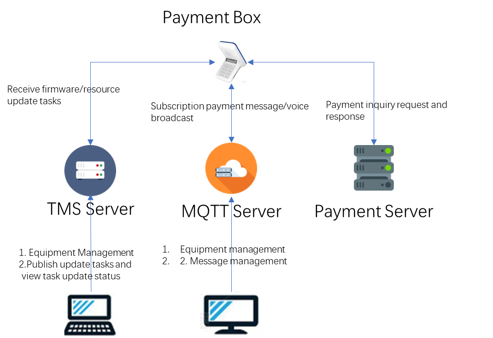

# IoT Secure Payment Cloud Speaker Integration Guide

# 1. Document Overview

This document is used to guide the integration of the IoT Secure Payment Cloud Speaker (also known as Payment Box) with MQTT Server, Payment Server, and TMS Server, enabling normal integration between the device and each system as well as the implementation of all full functions.

The device-side software processes all interactive data in JSON format by default. The server-side can choose to integrate in JSON format (no need to modify the device software) or customize the data format (need to modify the device-side software synchronously) to ensure integration efficiency and effectiveness.

# 2. Overall Architecture

## 2.1 Architecture Overview

The following is the relationship between the IoT Payment Cloud Speaker (Payment Box), MQTT Server, Payment Server, and TMS Server, realizing remote parameter management, two-way message communication, closed-loop payment process, and transaction record query functions.



## 2.2 Detailed Roles and Functions of Each Component

| Component Name                          | Core Role                                         | Detailed Function Description (Core Functions Related to Integration)                                                                                                                                                                                                                                                                                                                                                                                                                   | Associated Components                                            |
| --------------------------------------- | ------------------------------------------------- | --------------------------------------------------------------------------------------------------------------------------------------------------------------------------------------------------------------------------------------------------------------------------------------------------------------------------------------------------------------------------------------------------------------------------------------------------------------------------------------- | ---------------------------------------------------------------- |
| IoT Payment Cloud Speaker (Payment Box) | Terminal Execution Layer + Payment Transfer Layer | 1. Receive configuration parameters pushed by TMS; 2. Establish connection with MQTT Server, receive and parse messages in JSON format by default, and trigger voice broadcast; 3. Initiate payment and query requests to Payment Server (in JSON format by default), receive results and broadcast; 4. Report its own status to relevant servers (in JSON format by default); 5. If the server adopts a custom format, the software parsing logic needs to be modified for adaptation. | MQTT Server, Payment Server, TMS Server                          |
| MQTT Server                             | Message Communication Layer                       | 1. Receive voice broadcast messages pushed by the customer server and forward them to the device (JSON format or custom format can be selected; custom format requires synchronous modification of device software); 2. Receive status information reported by the device (in JSON format by default) and feed it back to the customer server; 3. Ensure two-way real-time communication between the device and the server.                                                             | IoT Payment Cloud Speaker (Payment Box), Customer Server         |
| Payment Server                          | Payment Core Layer                                | 1. Receive payment and query requests initiated by the device (in JSON format by default, can be adapted to custom format, which requires synchronous modification of device software), complete authentication, liquidation and query processing; 2. Generate response results (in JSON format by default, custom format needs to be adjusted synchronously), encrypt and return to the device; 3. Record transaction details for subsequent query and verification.                   | IoT Payment Cloud Speaker (Payment Box)                          |
| TMS Server                              | Parameter Management Layer                        | 1. Receive device configuration files uploaded by customers and package them into OTA upgrade packages; 2. Push parameter update instructions to the device (in JSON format by default) and record the push status; 3. Support remote parameter management and batch deployment of devices; 4. If the device software is modified to adapt to the custom format, the corresponding modified firmware upgrade package needs to be pushed through TMS.                                    | IoT Payment Cloud Speaker (Payment Box), Customer Management End |

# 3. Integration (Quick Integration)

To achieve quick integration between the device and MQTT Server/Payment Server, the device side supports integration through TMS push parameter configuration, without complex operations. The specific process and requirements are as follows:

--todo Flow Chart

## 3.1 Obtain Parameter Configuration Template

After downloading the entire project from github, find the cust.zip file in the 04_source directory. Unzip it to get the parameter configuration template posparam.ini. The template is in JSON format (UTF-8 encoding), which can be directly reused and modified without manually creating a configuration file. The template content is as follows:

```Plain
{
  "mqtt":{
    "mqtt_endpoint":"q123b328.ala.cn-hangzhou.emqxsl.cn",
    "mqtt_port":"8883",
    "mqtt_auth_cert":0,
    "mqtt_username":"",
    "mqtt_password":"",
    "mqtt_topic":"pos/message"
  },
  "payment":{
    "pgw_endpoint":"https://ypparbjfugzgwijijfnb.supabase.co",
    "pgw_port":"443",
    "pgw_auth_type":"api_key",
    "pgw_ssl_cert":1,
    "pgw_api_key":"sk_58a7b6c4d3e2f1a9b8c7d6e5f4a3b2c1",
    "pgw_api_key_expiry":"20261231",
    "pgw_api_sale":"/functions/v1/request-online-result-pos",
    "pgw_api_details":"/functions/v1/get-transaction-records-pos"
  }
}
```

## 3.2 Description of Field Meanings in Parameter Configuration Template

The parameter template includes two core modules: mqtt and payment, corresponding to the integration parameters of MQTT Server and Payment Server. The meaning and requirements of each field are as follows. When modifying, customers must strictly match the field type and value specification:

### 3.2.1 MQTT Module (MQTT Server Integration Parameters)

- mqtt_endpoint: Required, string type. Fill in the domain name or IP address of the customer's own MQTT Server for the device to establish a connection with the MQTT Server.

- mqtt_port: Required, string type. Fill in the communication port of the customer's own MQTT Server to ensure smooth communication between the device and the server.

- mqtt_auth_cert: Required, numeric type. Only 0 or 1 is supported, used to specify the MQTT Server authentication mode (0=Username/Password Authentication, 1=Certificate Authentication).

- mqtt_username: Optional, string type. Required when the authentication mode is 0. Fill in the authentication username of the MQTT Server.

- mqtt_password: Optional, string type. Required when the authentication mode is 0. Fill in the authentication password of the MQTT Server, and keep it confidential.

- mqtt_topic: Required, string type. Fill in the communication topic prefix specified by the customer. After the device starts, it will automatically complement its own SN to form a unique communication topic.

### 3.2.2 Payment Module (Payment Server Integration Parameters)

- pgw_endpoint: Required, string type. Fill in the domain name or IP address of the customer's own Payment Server for the device to initiate payment and query requests.

- pgw_port: Required, string type. Fill in the communication port of the customer's own Payment Server to ensure normal transmission of payment-related requests.

- pgw_auth_type: Required, string type. Fixed value is "api_key", which cannot be modified. It is used to specify the authentication mode of the Payment Server.

- pgw_ssl_cert: Required, numeric type. Only 0 or 1 is supported, used to specify the SSL verification setting of the Payment Server (0=No Verification, 1=Verification).

- pgw_api_key: Required, string type. Fill in the API key of the customer's own Payment Server for authentication of payment requests, and keep it confidential.

- pgw_api_key_expiry: Required, string type. The format is "YYYYMMDD". Fill in the expiration time of the API key. The key needs to be replaced and reconfigured before expiration.

- pgw_api_sale: Required, string type. Fill in the transaction request interface path of the Payment Server for the device to initiate payment requests.

- pgw_api_details: Required, string type. Fill in the transaction record query interface path of the Payment Server for the device to initiate transaction query requests.

## 3.3 Parameter and Firmware Update

TMS supports firmware update and resource update (parameter configuration belongs to resources). The generation and push operations of the two types of OTA packages are unified. The specific requirements are as follows:

1. OTA Package Packaging Specifications: All OTA packages (firmware packages, resource packages) must be packaged into zip format, and the zip file must contain the corresponding core files and resource.json file — the resource.json file is used by TMS to identify key information such as the type and version of the update package, ensuring normal parsing by the device.

2. Core File Requirements: Firmware core file: Use the compiled DS50_app.img file. The file name must be added with a version number according to the rules. Example: DS50_app_V1.0.0.img (the version number needs to be modified according to the actual version number).

3. Resource core files: Different types of resources need to be stored in categories. Parameter configuration files are placed in the cust directory, mp3 files in the mp3 directory, UI pictures in the ui directory, and certificate files in the key directory. Package all classified directories together to generate a resource compression package with a version number. Example: resource_V1.0.0.zip (the version number needs to be modified by +1 based on the firmware version number).

4. resource.json file: The value of the customerName field in the file needs to be modified. The default value of this field is DSPREAD, and the customer needs to customize and modify it according to their own name.

5. OTA Package Generation Operation: Run the *_package.ps1 script in the powershell environment to generate the OTA package that can be used for TMS push.

Operation Premise: Ensure that the powershell environment is normal, and the *_package.ps1 script can be executed normally without permission or dependency missing issues.

6. Command Requirements: When running the script, specify the name of the core file to be packaged (such as DS50_app_V1.0.0.img, resource_V1.0.0.zip); if the target file is not in the same path as the script, fill in the complete file path to avoid packaging failure.

7. Operation Example (powershell command):

`./firmware_package.ps1 DS50_app_V1.0.0.img`
`./resource_package.ps1 resource_V1.0.0.zip`

8. Generation Result: After the script runs successfully, the corresponding OTA package will be automatically generated. The package name format is as follows, which can be directly used for subsequent TMS push:
   
   1. Firmware OTA Package: AP_DS50-MQ_DSPREAD_V1.0.0.zip
   
   2. Resource OTA Package: CUST_DS50-MQ_DSPREAD_V1.0.0.zip

9. OTA Package Push: Follow the TMS system operation process, upload the corresponding OTA upgrade package (firmware package or resource package), associate the target device, and initiate the update push task. After the device receives the OTA package, it will automatically parse it to complete parameter application, firmware update or resource update.

## 3.4 Data Format for Integration Between Device and MQTT Server

The message interaction between the device and the MQTT Server adopts a fixed JSON format, and no modification to the device software is required. It is necessary to ensure that the messages pushed by the MQTT Server comply with the following format requirements; otherwise, the device cannot parse them normally:

```Plain
{
  "message": "hello",
  "amount": "12344",
  "transType": "00",
  "orderId": "12394555425"
}
```

Description and Requirements of Each Field:

- message: Optional, string type. Fill in the message prompt text to supplement transaction-related instructions, which can be modified according to actual scenarios.

- amount: Required, string type. Fill in the transaction amount in "cents" (the example "12344" corresponds to the actual amount of 123.44 yuan).

- transType: Required, string type. Only fixed values are supported ("00" = Transaction Guidance Mode, the device broadcasts payment guidance; "99" = Amount Broadcast Mode, the device only broadcasts the transaction amount).

- orderId: Required, string type. Fill in a unique order number to associate transaction records for subsequent query and verification.

## 3.5 Data Format for Integration Between Device and Payment Server

The interaction between the device and the Payment Server (payment request, payment response, transaction query) adopts a fixed JSON format. It is necessary to ensure that the customer's own Payment Server strictly adapts to this format to realize normal interaction of request reception and response return. The specific format is as follows:

### 3.5.1 Payment Request (online request)

When the device initiates a payment request to the Payment Server, the following fixed format is adopted. All fields are required and automatically filled in by the device:

```Plain
{
  "deviceSn":"S20A1012574P0002",
  "model":"DS50",
  "transType":"SALE",
  "appVersion":"V1.0.0",
  "payType":"CARD",
  "transAmount":"66.66",
  "cardNo":"451461********2125",
  "cardOrg":"VISA",
  "emvData":"9F260888C89C10C57849A79F2701809F100706011203A020009F3704FCB8E0FA9F36020742950580800080009A032512159C01009F02060000000066665F2A020170820218009F1A0201709F03060000000000009F3303E0F8C89F34031E03009F3501219F1E0838333230314943438407A00000000310109F09020001",
  "batchNo":"000000",
  "traceNo":"000001",
  "track2":"4514617628832125D270120115195475",
  "pin":"ADF34EF2424A042E",
  "date":"2025-12-15",
  "time":"15:50:23"
}
```

### 3.5.2 Payment Response (online response)

After the Payment Server processes the payment request, it must return the following fixed-format response to the device to ensure that the device can parse the transaction result normally:

```Plain
{
  "acqAuthCode":"1234567890",
  "acqResponseCode":"00",
  "emvData":"",
  "transStatus":"APPROVE"
}
```

### 3.5.3 Transaction Query (request & response)

When the device initiates a transaction query request to the Payment Server, it only queries the transaction data of the specified device within the specified date, with a fixed 1 record per page. The specific format is as follows:

1. Transaction Query Request (transaction details request):

```Plain
{
  "deviceSn":"S20A1012574P0002",
  "pageNo":"1",
  "pageSize":"1",
  "date":"2025-12-15"
}
```

2. Transaction Query Response (transaction details response):

```Plain
{
  "respCode":"00",
  "total":1,
  "transInfo": [
    {
      "transStatus": "APPROVED",
      "acqAuthCode": "12345678",
      "transAmount": "10000",
      "transType": "SALE",
      "cardNo": "451461********2125",
      "cardOrg": "VISA",
      "traceNo":"000001",
      "batchNo":"000000",
      "transDatetime": "2023-11-24 13:25:10",
    }
  ]
}
```

Note: respCode "00" indicates a successful query. total fills in the total number of transactions found (0 = no matching transactions, 1 = matching transactions). The transInfo array contains only 1 transaction detail. cardNo needs to be masked (display the first 6 digits and the last 4 digits, with **** in the middle) to ensure information security.

# 4. Device Working Instructions After Integration

After completing all the step-by-step integration processes from 3.1 to 3.5 above and verifying that each step is normal without abnormalities, the IoT Payment Cloud Speaker (Payment Box) has completed all integration configurations. It can normally achieve stable integration with the customer's servers (including MQTT Server, Payment Server, and TMS Server) and can be put into normal operation to implement all preset core functions.